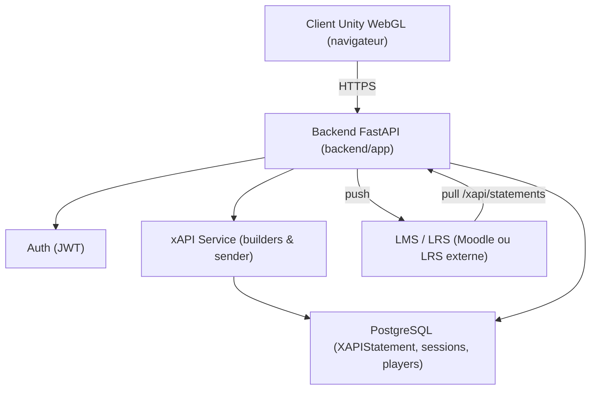
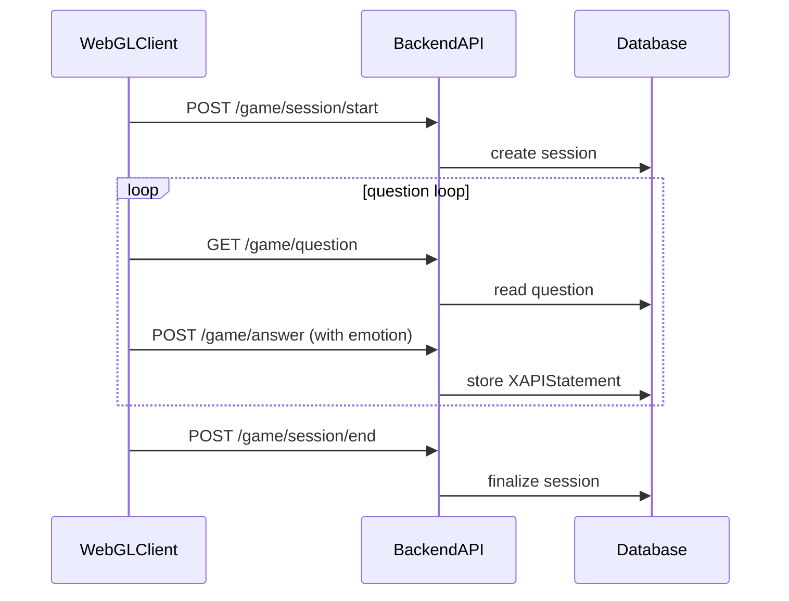
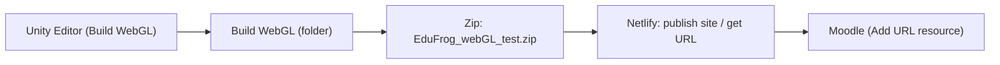
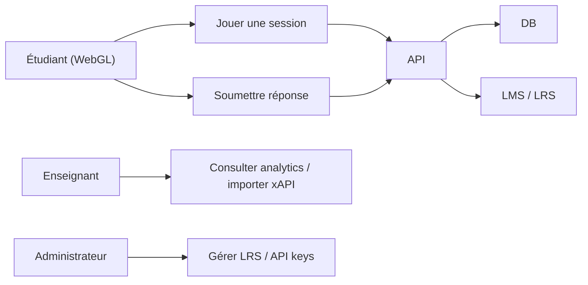
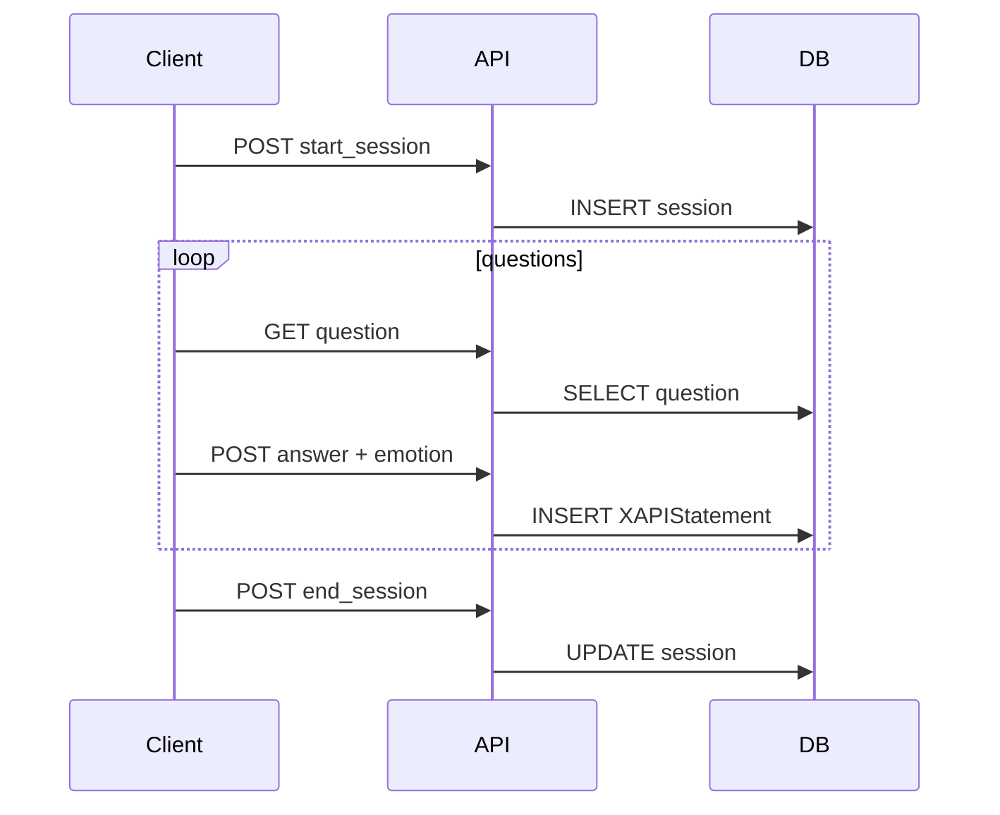
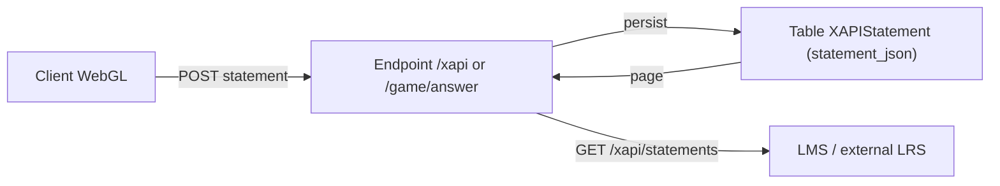
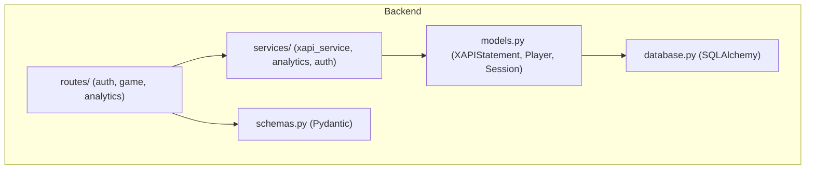
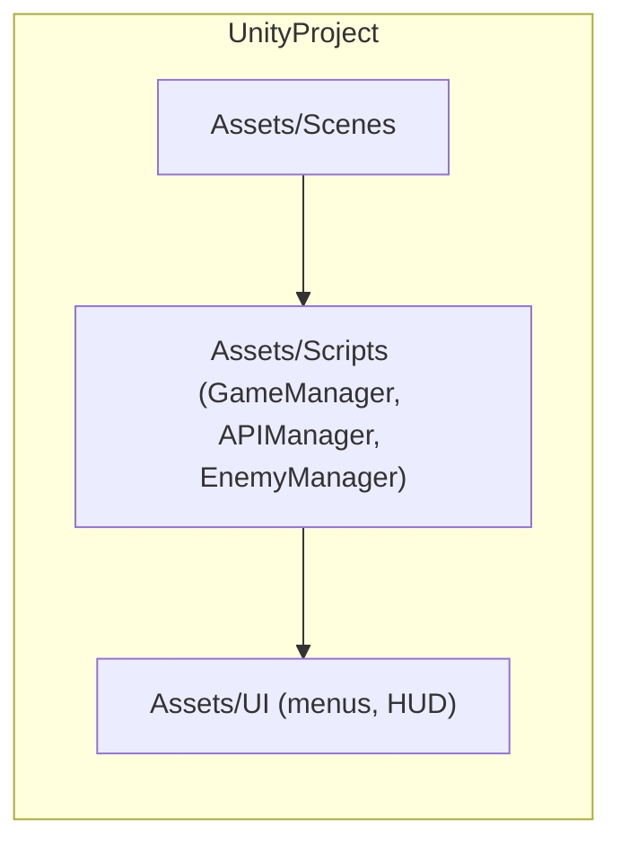

Projet EduFrog — Documentation académique (PFE)
===============================================

Version : 1.0.0

Date : 13 mai 2026

Statut : Documentation technique pour mémoire (PFE)

------------------------------------------------------------------------

1. Titre du projet
-------------------

Projet EduFrog — Plateforme d'apprentissage adaptatif (Unity WebGL + FastAPI)

------------------------------------------------------------------------

2. Introduction générale
-------------------------

Ce document présente une analyse complète et strictement factuelle du projet EduFrog telle qu'elle peut être déduite des fichiers présents dans le dépôt. L'objectif est de fournir un point d'appui solide pour la rédaction d'un mémoire de Master / PFE : description technique, architecture, analyse du backend et du frontend, diagrammes académiques pertinents, workflow d'intégration LMS et procédure de déploiement via Netlify.

L'analyse a été réalisée par lecture statique du code et des fichiers du workspace ; aucune modification du code source n'a été effectuée.

------------------------------------------------------------------------

3. Contexte du projet
----------------------

Résumé fonctionnel

- Client : jeu pédagogique 2D développé sous Unity (répertoire `2dgameAllLeveles/`).
- Backend : API REST asynchrone en Python (FastAPI) dans `backend/app/` ; persistance via SQLAlchemy et PostgreSQL.
- Trace pédagogique : interactions converties en énoncés xAPI (ADL) et stockées dans la table `XAPIStatement`.
- Authentification : jetons JWT (modules d'auth présents dans `backend/app/services` et `backend/app/routes/auth.py`).

Domaine d'application : éducation numérique — intégration au LMS (Moodle) via récupération (pull) d'énoncés xAPI ou ingestion de l'URL du build WebGL.

------------------------------------------------------------------------

4. Architecture globale
-----------------------

Description synthétique

L'architecture est composée de trois couches principales :
- Client WebGL (Unity) : interface de jeu et capteur émotionnel (Webcam).  
- Backend FastAPI : API REST, services métier, construction et stockage xAPI, envoi optionnel vers LRS externe.  
- Stockage : PostgreSQL (schéma `adaptive`) et éventuellement Redis pour cache.

Diagramme de l'architecture globale

Notes : le schéma s'appuie sur les dossiers et fichiers présents : `backend/app/services/xapi_service.py`, `backend/app/models.py`, `backend/app/routes/analytics.py`.

------------------------------------------------------------------------

5. Analyse détaillée du backend
-------------------------------

5.1 Structure générale

- Dossier principal : `backend/app/`.
- Fichiers notables : `main.py`, `database.py`, `models.py`, `schemas.py`, `routes/` (endpoints), `services/` (xapi_service, analytics, auth), `utils/`.

5.2 Services et responsabilités

- `xapi_service.py` : construction des énoncés xAPI (verbs, actor, object, result, context) et fonction d'envoi (best-effort) vers un LRS externe si configuré.
- `analytics_service.py` : fonctions d'agrégation et lecture paginée (`get_xapi_statements`) pour extraction et reporting.
- `game_service.py` / `routes/game` : gestion du cycle de session (start_session, submit_answer, end_session) — génère statements non bloquants.
- `auth_dependencies.py` et routes `auth.py` : gestion JWT (login/register) et dépendances FastAPI pour authentification.

5.3 Logique métier observée

- Sessions de jeu : création d'un enregistrement de session, association des réponses et des événements.
- Questions / réponses : les réponses sont évaluées, converties en statements xAPI et persistées.
- Emotion pipeline : détection via DeepFace / MediaPipe (présence de scripts de test), résultats stockés et enrichissent le contexte des énoncés xAPI.

5.4 API / Endpoints (extraits pertinents)

Liste non exhaustive (tirée du README précédent et des routes observées) :
- `POST /auth/login`, `POST /auth/register`
- `GET /player/profile`, `GET /player/courses`
- `POST /game/session/start`
- `GET /game/question` (GetNextQuestion)
- `POST /game/answer` (SubmitAnswer)
- `POST /game/emotion` (emotion detection)
- `POST /game/session/end`
- `GET /teacher/analytics/...` (résumés)
- `GET /xapi/statements` (nouvel endpoint paginé)

Remarque : la documentation des schémas Pydantic se trouve dans `backend/app/schemas.py` (notamment `XAPIStatementResponse`).

5.5 Données et modèles

- Modèle principal : `XAPIStatement` (id, session_id FK, statement_json JSON, sent bool, created_at timestamp).
- Autres modèles : Player, Session, Question, Progress — implémentés dans `backend/app/models.py`.
- Le stockage des statements conserve le JSON brut `statement_json` : ceci garantit compatibilité ADL mais nécessite précautions RGPD.

5.6 Configuration

- Variables d'environnement attendues : base de données, credentials LRS (`LRS_ENDPOINT`, `LRS_USERNAME`, `LRS_PASSWORD`), paramètres JWT.
- Fichiers utiles : `.env.example` (présence probable dans `backend/`).

5.7 Observations opérationnelles

- L'endpoint `GET /xapi/statements` ajoute un modèle de récupération pull complémentaire au push existant.  
- Les limitations de pagination (limit, offset) et le champ `sent` sont des mécanismes de sécurité et de robustesse.

------------------------------------------------------------------------

6. Analyse détaillée du frontend
--------------------------------

6.1 Structure générale

- Projet Unity : répertoire `2dgameAllLeveles/` contenant `Assets/`, `Library/`, `ProjectSettings/`, `Scenes/`, `Scripts/` et fichiers de solution Visual Studio.
- Principaux scripts : `GameManager.cs`, `APIManager.cs`, `EnemyManager`, etc. (dans `Assets/Scripts/`).

6.2 Composants et pages

- Client de jeu : scènes Unity (niveaux) et UI (menus, HUD).  
- Module Webcam / Emotion : composant de capture et envoi d'images (intégration via tests `test_mediapipe_live.py`, `test_deepface_live.py` au niveau backend).

6.3 Interactions et communication

- Le client communique avec le backend via `UnityWebRequest` (endpoints REST listés ci-dessus).
- Flux typique : sélection de cours → demande `StartSession` → boucle de questions (`GetNextQuestion`) → `SubmitAnswer` (avec metadata émotionnelle) → `EndSession`.

6.4 Organisation du code

- Scripts C# organisés par dossiers Unity (`Assets/Scripts/`).  
- Fichiers de configuration de build WebGL gérés via Unity (PlayerSettings) et pipeline CI (non présent sous forme de code dans le repo mais documenté dans README).

6.5 Observations

- Le client est conçu pour être compilé en WebGL et hébergé comme site statique.  
- Les appels réseau sont RESTful et attendent des réponses JSON conformes aux schémas Pydantic du backend.

------------------------------------------------------------------------

7. Modules spéciaux
-------------------

7.1 Unity / WebGL

- Le projet Unity est complet dans `2dgameAllLeveles/` ; le build WebGL doit être produit via Unity Editor / CLI et compressé pour hébergement statique.
- Le code Unity mentionne la gestion automatique de la difficulté (hearts mapping) et correctifs récents (gestion de `SetCourseId()` dans `GameManager.cs`).

7.2 Intégration navigateur

- Build WebGL exposé comme site statique ; communication avec backend via HTTPS.  
- Pour l'intégration LMS, on publie le zip du build sur Netlify (ou autre hébergement statique) pour obtenir une URL publique.

7.3 Tests et scripts utiles

- Le backend contient des scripts de test pour les pipelines émotionnels : `test_deepface_live.py`, `test_mediapipe_live.py`.

------------------------------------------------------------------------

8. Technologies utilisées
------------------------

- Unity 2022.x (2D) — client de jeu
- C# — scripts client
- FastAPI (Python) — backend
- SQLAlchemy — ORM
- PostgreSQL — base de données relationnelle
- JWT — authentification
- DeepFace / MediaPipe — pipelines de détection d'émotion (intégration côté backend)
- Netlify (ou hôte statique équivalent) — hébergement WebGL

------------------------------------------------------------------------

9. Modifications récentes
-------------------------

Résumé des changements observés

- Ajout des schémas de réponse xAPI dans `backend/app/schemas.py` (`XAPIStatementResponse`, `XAPIStatementsResponse`).
- Ajout du service de lecture paginée `get_xapi_statements` dans `backend/app/services/analytics_service.py`.
- Ajout de l'endpoint `GET /xapi/statements` dans `backend/app/routes/analytics.py`.
- Corrections mineures côté client : correction `SetCourseId()` dans `GameManager.cs` pour permettre le changement de cours sans verrouillage indésirable.

Impact et analyse

- Ces changements sont principalement orientés vers l'interopérabilité pédagogique : ajout d'un mode pull permettant au LMS de récupérer les statements stockés.  
- Ils n'altèrent pas la construction des statements : `statement_json` est renvoyé tel que stocké, ce qui facilite la conformité ADL et la ré-ingestion.
- Mesures recommandées : restreindre l'accès à l'endpoint par JWT + contrôle de rôle, journalisation des extractions, politique d'anonymisation si export vers tiers.

------------------------------------------------------------------------

10. Workflow global du projet
----------------------------

Flux opérationnel simplifié (client ↔ backend ↔ stockage)

------------------------------------------------------------------------

11. Intégration LMS — Workflow réel fourni
-----------------------------------------

Le workflow exact fourni par l'utilisateur pour intégrer le build WebGL dans le LMS est le suivant. Il doit être reproduit tel quel pour la validation d'intégration :

1. Zipper le dossier du build WebGL (`EduFrog_webGL_test.zip`).
2. Dans le LMS, activer « Turn editing on ». 
3. Choisir « Add activity or resource ». 
4. Sélectionner « URL ». 
5. Utiliser Netlify pour convertir le dossier zip en URL publique (uploader le zip ou publier le build). 
6. Récupérer l'URL fournie par Netlify. 
7. Dans la ressource LMS, coller l'URL et donner le titre « EduFrog ». 
8. Sauvegarder : la ressource pointe désormais vers le build WebGL intégré.

Remarque : cette procédure correspond à l'approche « hébergement statique + lien LMS » et n'exige pas d'API spécifique côté LMS.

------------------------------------------------------------------------

12. Déploiement via Netlify (procédé détaillé)
--------------------------------------------

Étapes recommandées pour produire et déployer le build WebGL :

1. Ouvrir le projet Unity (`2dgameAllLeveles/`) dans l'Editor (Unity 2022.x compatible).
2. Configurer PlayerSettings → WebGL ; s'assurer des paramètres de compression (gzip/Brotli) et du support WebGL 2.0.
3. Lancer le build WebGL (File → Build). Récupérer le dossier `Build` complet.
4. Compresser le dossier WebGL en `EduFrog_webGL_test.zip`.
5. Sur Netlify : Drag & drop du dossier décompressé ou du zip (site static) → Netlify génère une URL publique.
6. Vérifier que les appels API côté client pointent vers l'URL du backend FastAPI (configuration dans `APIManager.cs` ou PlayerPrefs du projet Unity).

Diagramme : pipeline de build et publication

Remarque pratique : Netlify accepte aussi le drag-and-drop du dossier `Build` (non zippé) et génère l'URL.

------------------------------------------------------------------------

13. Diagrammes académiques pertinents
------------------------------------

Les diagrammes inclus sont limités aux artefacts réellement présents ou nécessaires au projet : architecture globale, workflow session, diagramme de flux de données xAPI, diagramme de structure backend, diagramme de structure frontend, pipeline Netlify.

13.1 Diagramme de cas d'utilisation du projet EduFrog

Description : acteurs et cas d'usage principaux.

13.2 Diagramme de séquence — cycle de session (simplifié)

13.3 Diagramme de flux de données xAPI

13.4 Diagramme de composants — structure backend

13.5 Diagramme de structure frontend (Unity)

------------------------------------------------------------------------

14. Section démonstrations (placeholders)
----------------------------------------

Préparer les éléments visuels pour le mémoire :

- Screenshot frontend (jeu WebGL) : [à insérer]
- Screenshot LMS (ressource URL) : [à insérer]
- Screenshot WebGL (console / network) : [à insérer]
- Vidéo de démonstration : [à insérer]

Ces emplacements restent vides ici par contrainte demandée.

------------------------------------------------------------------------

15. Conclusion
--------------

Cette documentation présente une vision complète et vérifiable du projet EduFrog telle qu'elle ressort des fichiers du dépôt. Les modifications récentes se concentrent sur l'ajout d'un endpoint paginé pour récupérer des énoncés xAPI, renforçant l'interopérabilité avec les LMS. Pour finaliser l'intégration en production, il est recommandé de :

- Appliquer un contrôle d'accès strict (JWT + vérification de rôle) sur l'endpoint `GET /xapi/statements`.
- Mettre en place une journalisation d'extraction et une politique d'anonymisation pour les exports tiers.
- Indexer les colonnes fréquemment interrogées (`created_at`, `session_id`, `player_id`) pour optimiser les lectures paginées.

------------------------------------------------------------------------

Annexe — fichiers clés (emplacement relatif)

- `2dgameAllLeveles/` : projet Unity (Assets, Scenes, Scripts)
- `backend/app/main.py` : point d'entrée FastAPI
- `backend/app/models.py` : modèles SQLAlchemy (XAPIStatement, Session, Player)
- `backend/app/schemas.py` : Pydantic schemas (XAPIStatementResponse ajouté)
- `backend/app/services/xapi_service.py` : construction/envoi des statements
- `backend/app/services/analytics_service.py` : fonction `get_xapi_statements`
- `backend/app/routes/analytics.py` : endpoint `GET /xapi/statements`

------------------------------------------------------------------------
##  Demo — Adaptive Learning Game (AI + Emotion + NPC Interaction)

---

###  Course Selection + Real-time Emotion Detection (Camera)

https://github.com/user-attachments/assets/88ca7fc1-77f3-4873-a910-a50b6ebc628a

 Cette partie montre :
- Sélection du cours par le joueur  
- Intégration de la caméra  
- Détection des émotions en temps réel  
- Adaptation de l’expérience selon l’état émotionnel du joueur  

---

###  NPC Interaction — Simplified & Reformulated Explanation

https://github.com/user-attachments/assets/cc4ca0a3-71be-422b-b153-17f831e99da2

 Ici, le joueur interagit avec un NPC qui :
- Explique le contenu du cours de manière simplifiée  
- Reformule les concepts pour faciliter la compréhension  
- Adapte l’explication selon le niveau du joueur  

---

##  Level 1 — Adaptive AI System

<h3 align="center">
Adaptive Difficulty Based on Player Answers, Enemy Behavior, and Emotion Detection
</h3>

  
  
  

   

---

##  Difficulty Levels Showcase

###  Hard Level

  
  
  

  
  

---

###  Easy Level

  
  

Fin de la documentation.
