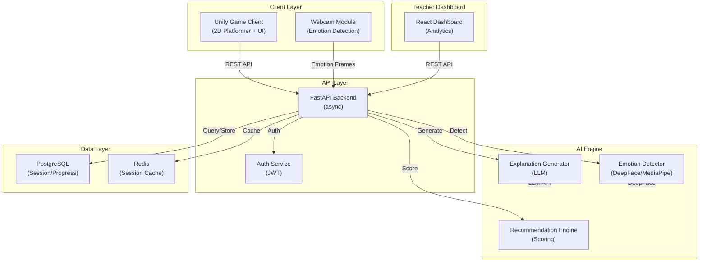
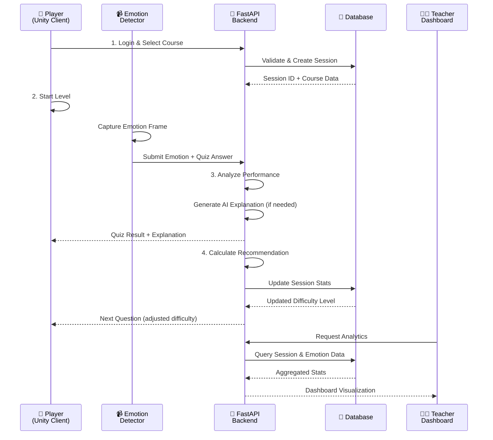
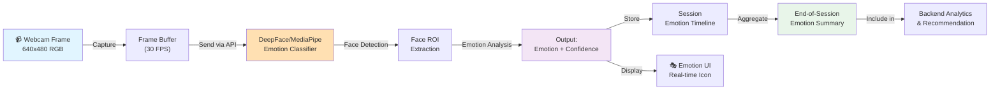
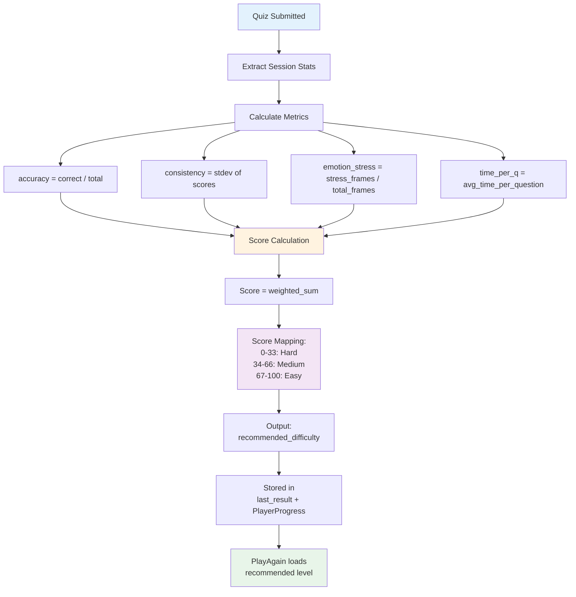
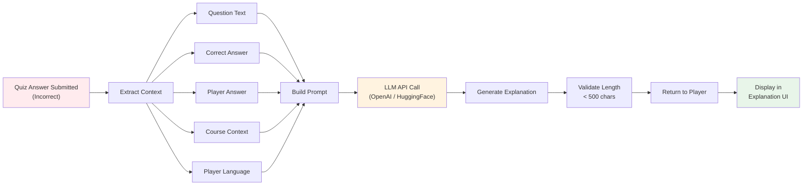
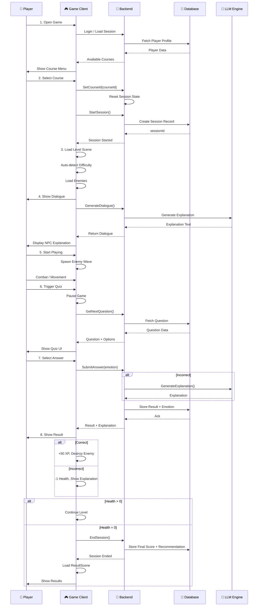

# EduFrog: AI-Powered Adaptive Learning Game

[]()
[]()
[]()
[]()

## Table of Contents

- [Overview](#overview)
- [System Architecture](#system-architecture)
- [Key Features](#key-features)
- [User Systems](#user-systems)
- [AI & Adaptive Engine](#ai--adaptive-engine)
- [Game Loop](#game-loop)
- [Technical Stack](#technical-stack)
- [Installation & Setup](#installation--setup)
- [API Documentation](#api-documentation)
- [Contributing](#contributing)

---

## Overview

**EduFrog** is an AI-powered serious game designed to teach educational content through adaptive gameplay with real-time emotion detection and personalized learning paths.

### Core Mission

Transform educational engagement by combining:
- **Adaptive Game Mechanics**: Difficulty adjusts based on player performance and emotional state
- **Real-Time Emotion Detection**: Webcam-based facial emotion recognition to detect stress, confusion, and engagement
- **Intelligent Explanations**: AI-generated contextual explanations for quiz answers in multiple languages
- **Teacher Analytics**: Comprehensive dashboard for educators to track student progress and emotional engagement patterns

### Target Users

- **Players**: Students aged 8-18 learning from curated educational content
- **Teachers**: Educators who create and manage courses, monitor student progress, and analyze emotional engagement
- **Administrators**: Institutional users managing multiple courses and player cohorts

---

## System Architecture

### High-Level Architecture



### Component Interaction Diagram



---

## Key Features

### 🎮 Gameplay Features

| Feature | Description |
|---------|-------------|
| **Adaptive Difficulty** | Real-time difficulty adjustment (Easy/Medium/Hard) based on performance and emotion |
| **Quiz System** | Multiple-choice questions with instant feedback and AI explanations |
| **Emotion Detection** | Webcam-based emotion recognition detecting stress, confusion, engagement |
| **Language Support** | Multi-language course content and explanations |
| **XP & Progression** | Leveling system with XP rewards tied to performance |
| **Real-time Analytics** | Live tracking of player emotions and performance metrics |

### 🏫 Teacher Dashboard Features

| Feature | Description |
|---------|-------------|
| **Course Management** | Create, edit, and deploy custom educational courses |
| **Student Tracking** | Monitor individual and cohort-level progress |
| **Emotion Analytics** | Visual analysis of student emotional states during learning |
| **Performance Reports** | Detailed session reports with quiz accuracy and time metrics |
| **Recommendation Insights** | View recommended difficulty adjustments for each student |
| **Export Data** | Export session data and analytics for external analysis |

---

## User Systems

### Player Flow

#### 1. **Login & Course Selection**

```
Player opens game
    ↓
Enter credentials / Create account
    ↓
Backend validates (JWT token issued)
    ↓
Displays available courses (from teacher dashboard API)
    ↓
Player selects course
    ↓
GameManager receives courseId + sets initial difficulty
```

#### 2. **Gameplay Loop**

```
Level Starts
    ↓
EnemyManager spawns enemy waves
    ↓
Player interaction (combat or quiz trigger)
    ↓
Quiz Display with AI-generated explanation for incorrect answers
    ↓
Performance tracked and stored
    ↓
Recommendation calculated
    ↓
Level end (health=0 or completed)
```

#### 3. **Emotion Tracking During Gameplay**

```
Every frame:
    ↓
EmotionCamera captures webcam frame
    ↓
Send frame to backend emotion detector
    ↓
Backend returns: dominant_emotion, confidence
    ↓
EmotionUI displays emotion icon
    ↓
Emotion data stored in session context
```

### Teacher Dashboard Flow

#### 1. **Course Management**

Teachers can create, edit, and manage courses with:
- Course name and description
- Language (French, English, etc.)
- Quiz questions with multiple-choice answers
- Custom explanations and difficulty mapping

#### 2. **Student Progress Tracking**

Real-time monitoring of:
- Student quiz accuracy and session history
- Time spent per level
- Dominant emotions detected
- Recommended difficulty progression
- XP and level advancement

#### 3. **Analytics & Emotion Insights**

Advanced analytics including:
- Emotion distribution across cohorts
- Correlation between emotion and performance
- Stress level trends
- Engagement heatmaps
- Exportable reports (CSV/PDF)

---

## AI & Adaptive Engine

### Emotion Detection Pipeline



#### Emotion Classes Detected

| Emotion | Indicates |
|---------|-----------|
| **Happy** | Engagement, understanding |
| **Sad** | Frustration, difficulty |
| **Neutral** | Passive learning |
| **Surprised** | Confusion, unexpected event |
| **Angry** | High frustration |
| **Disgusted** | Rejection, disagreement |
| **Fearful** | Anxiety, stress |

### Adaptive Difficulty Recommendation Engine



#### Recommendation Algorithm

```
FUNCTION recommend_difficulty(session_stats):
    accuracy = correct_answers / total_questions
    wrong_answers_count = total_questions - correct_answers
    stress_ratio = stress_emotions / total_emotion_frames
    
    // Weighted scoring
    performance_score = accuracy * 60           // 60% weight
    emotional_score = (1 - stress_ratio) * 30   // 30% weight
    engagement_bonus = consistency * 10         // 10% weight
    
    final_score = performance_score + emotional_score + engagement_bonus
    
    IF final_score >= 70:
        RETURN "Hard"
    ELSE IF final_score >= 40:
        RETURN "Medium"
    ELSE:
        RETURN "Easy"
END
```

#### Difficulty Levels & Hearts

| Difficulty | Hearts | Enemy Difficulty | XP Multiplier | Target Accuracy |
|------------|--------|-----------------|---------------|-----------------|
| **Easy** | 5 | Low | 1.0x | 60%+ |
| **Medium** | 3 | Medium | 1.5x | 70%+ |
| **Hard** | 2 | High | 2.0x | 85%+ |

### AI Explanation Generation Pipeline



### XP & Scoring System

```
Quiz Question Answered
    ↓
    IF correct:
    │   Base XP = 50
    │   Accuracy Bonus = 10 * (correct_streak / 5)
    │   Difficulty Multiplier = 1.0 | 1.5 | 2.0
    │   Emotion Bonus = 10 if happy/engaged
    │   Time Bonus = 5 if answered quickly
    │   Total XP = Base × Difficulty × (1 + Bonus%)
    │   Enemy Destroyed ✓
    │
    ELSE (incorrect):
    │   XP = 0
    │   Health -1
    │   Show explanation
    └─
    
Session End:
    XP accumulated → PlayerProgress.xp
    Level up check:
        IF xp >= threshold[level]:
            level++
```

---

## Game Loop

### Complete Gameplay Sequence



---

## Technical Stack

### Frontend (Game Client)

| Component | Technology | Purpose |
|-----------|-----------|---------|
| **Game Engine** | Unity 2022.3+ | Main game development |
| **2D Graphics** | Unity Sprite System | Character/enemy rendering |
| **Physics** | Rigidbody2D, Collider2D | Movement and collision |
| **Animation** | Animator Controller | Character animations |
| **UI** | TextMesh Pro, Canvas | HUD and menus |
| **Networking** | UnityWebRequest | REST API communication |
| **Webcam** | OpenCV plugin | Frame capture |

### Backend (API Server)

| Component | Technology | Purpose |
|-----------|-----------|---------|
| **Framework** | FastAPI (Python) | Async REST API |
| **Database** | PostgreSQL | Data persistence |
| **Cache** | Redis | Session caching |
| **ORM** | SQLAlchemy | Database abstraction |
| **Auth** | JWT Tokens | Secure sessions |

### AI & ML

| Component | Technology | Purpose |
|-----------|-----------|---------|
| **Emotion Detection** | DeepFace / MediaPipe | Real-time emotion recognition |
| **LLM** | OpenAI API / HuggingFace | AI-generated explanations |
| **Image Processing** | OpenCV | Frame preprocessing |

### Teacher Dashboard

| Component | Technology | Purpose |
|-----------|-----------|---------|
| **Frontend** | React 18+ | Interactive UI |
| **Charts** | Chart.js / Recharts | Data visualization |
| **API Client** | Axios | REST communication |

---

## Installation & Setup

### Prerequisites

- Python 3.9+
- Unity 2022.3+
- Node.js 16+
- PostgreSQL 12+
- Redis 6+

### Backend Setup

```bash
cd backend
python -m venv venv
source venv/bin/activate
pip install -r requirements.txt
cp .env.example .env
alembic upgrade head
python -m uvicorn main:app --reload
```

### Frontend (Unity) Setup

1. Open Unity Hub
2. Add project folder
3. Select Unity 2022.3+
4. Configure API endpoint in settings
5. Build and run

### Dashboard Setup

```bash
cd dashboard
npm install
npm start
```

---

## API Documentation

### Authentication

All endpoints (except `/auth/*`) require JWT bearer token:

```
Authorization: Bearer <JWT_TOKEN>
```

### Core Endpoints

| Method | Endpoint | Description |
|--------|----------|-------------|
| `POST` | `/auth/login` | Player login |
| `POST` | `/auth/register` | Player registration |
| `GET` | `/player/profile` | Get player profile |
| `GET` | `/player/courses` | List available courses |
| `POST` | `/game/session/start` | Create game session |
| `GET` | `/game/question` | Get next question |
| `POST` | `/game/answer` | Submit answer |
| `POST` | `/game/emotion` | Submit emotion frame |
| `POST` | `/game/session/end` | End game session |
| `GET` | `/teacher/analytics/summary` | Dashboard summary |
| `GET` | `/teacher/analytics/emotions` | Emotion analytics |

---

## Key Fixes & Improvements

### Course Selection Bug Fix

**Problem:** Selecting a new course after playing was blocked by `courseIdLocked`

**Solution:** Modified `SetCourseId()` to reset session flags when a different course is selected

```csharp
if (newCourseId != courseId || courseIdLocked)
{
    courseId = newCourseId;
    courseIdLocked = false;
    startSessionCalled = false;
    sessionId = 0;
    bootstrapped = false;
}
```

**Result:**
- ✅ Course switching works correctly
- ✅ Explanations use correct language/context
- ✅ Questions from correct course
- ✅ Retry behavior preserved

### Difficulty-Based Hearts

**Implementation:**
- Easy level (Level*_Easy): 5 hearts
- Medium level (default): 3 hearts
- Hard level (Level*_Hard): 2 hearts

Scene name auto-detection in `OnSceneLoaded()`

---

## Contributing

### Code Standards

- **Python:** PEP 8, Black formatter
- **C#:** Microsoft C# Coding Conventions
- **TypeScript/React:** Prettier + ESLint

### Git Workflow

1. Create feature branch: `git checkout -b feature/description`
2. Commit: `git commit -m "feat: description"`
3. Push: `git push origin feature/description`
4. Create Pull Request

---

## Support

- **Issues:** GitHub Issues for bug reports
- **Discussions:** GitHub Discussions for Q&A
- **Email:** contact@edufrog.dev

---

## License

This project is proprietary and confidential. All rights reserved.

---

**Last Updated:** May 11, 2026  
**Version:** 1.0.0  
**Status:** Active Development
