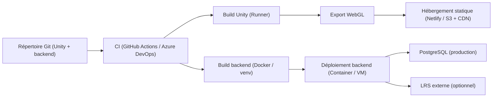
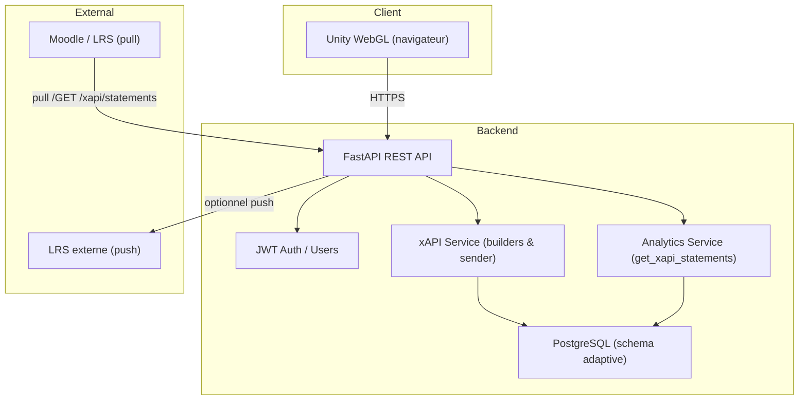
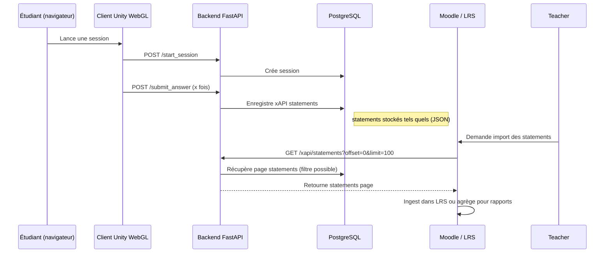

# Documentation PFE — Projet EduGame (Adaptatif WebGL + LMS)

**Version**: 1.0.0  
**Date**: 12 mai 2026  
**Statut**: Rédaction pour mémoire / PFE

---

**Résumé**

Ce document présente une synthèse académique et technique du projet EduGame, une plateforme d'apprentissage adaptatif constituée d'un client Unity 2D exporté en WebGL et d'un backend FastAPI. Le projet enregistre les interactions apprenant sous forme d'énoncés xAPI, les stocke dans une base PostgreSQL, et expose des mécanismes d'intégration avec des LRS ou un LMS (par ex. Moodle).

Objectif du document : fournir un contenu structuré, technique et prêt à intégrer dans un mémoire de fin d'études (PFE), incluant l'analyse des modifications récentes, diagrammes système à jour et recommandations techniques.

---

**Table des matières**

- Introduction générale
- Analyse des modifications récentes
- Diagrammes système (Mermaid)
- Workflow global et pipeline de déploiement
- Considérations techniques et recommandations
- Section démonstration (placeholders)
- Conclusion

---

## 1. Introduction générale

Présentation du projet

Le projet est composé de deux parties principales : un client Unity 2D (jeu plateforme pédagogique) compilé en WebGL pour distribution web, et un backend Python (FastAPI) assurant l'authentification, la gestion de sessions, la génération et le stockage d'énoncés xAPI, l'orchestration des services d'IA (détection d'émotions et génération d'explications) et l'exposition d'API pour l'ingestion par un LRS ou LMS.

Objectif global

Proposer une expérience d'apprentissage adaptative où :
- les performances et l'état affectif de l'apprenant influencent la difficulté,  
- toutes les interactions pédagogiques sont traçables via xAPI,  
- les données sont exposables aux environnements d'apprentissage (Moodle/LRS) pour reporting et archival.

Contexte technique

Client : Unity 2022.3+ export WebGL.  
Backend : FastAPI, SQLAlchemy, PostgreSQL.  
Authentification : JWT.  
xAPI : énoncés ADL compatibles stockés brut en base.  
Déploiement : client statique (Netlify/S3) et backend conteneurisé.

---

## 2. Analyse des modifications récentes

Objectif : lister, expliquer et analyser l'impact des changements récents implémentés côté backend.

Modifications identifiées

- Ajout de schémas Pydantic d'exposition : `XAPIStatementResponse` et `XAPIStatementsResponse` (dans `backend/app/schemas.py`).
- Ajout d'une fonction de service de lecture paginée : `get_xapi_statements(...)` (dans `backend/app/services/analytics_service.py`).
- Ajout d'un endpoint REST `GET /xapi/statements` (dans `backend/app/routes/analytics.py`) fournissant un point d'accès paginé et filtrable aux énoncés xAPI.
- Mise en place de garde-fous de pagination (`limit` par défaut 100, `limit` max 1000) et d'offset pour éviter des requêtes massives.
- Conservation stricte du JSON original `statement_json` : le backend renvoie les énoncés tels qu'enregistrés (aucune transformation automatique).

Ancien workflow vs nouveau workflow

- Ancien : génération et tentative d'envoi (push) vers un LRS externe ; dépendance à la disponibilité du LRS pour l'archivage.
- Nouveau : ajout d'un point d'accès pull côté backend permettant au LMS/LRS de récupérer directement les énoncés stockés (pagination + filtres). Ainsi, l'intégration peut se faire par ré-ingestion ou extraction directe sans dépendre uniquement du push externe.

Impact global

- Avantages : meilleure résilience de l'intégration LMS, facilitation des audits et exports, compatibilité plus simple avec des outils d'analytics (Learning Locker, Moodle plugins).  
- Risques : nécessité d'enforcer l'authentification et les politiques d'accès (qui peut lire ces énoncés), gestion de la vie privée (PII dans `actor`), et contraintes de performance pour gros volumes (indexation, streaming).

Recommandation immédiate

- Enforcer `Depends(get_current_user)` + contrôle de rôle (enseignant/admin) sur `GET /xapi/statements`.  
- Documenter la présence possible de données personnelles dans `actor` et prévoir une option d'anonymisation pour exports tiers.

---

## 3. Diagrammes système (REFONTE COMPLÈTE)

Pour chaque diagramme : titre académique, description courte, diagramme en Mermaid.

1) **Diagramme de cas d’utilisation du système EduGame WebGL — Intégration LMS**

Description courte : Cas d'utilisation principaux (Étudiant, Enseignant, LMS/LRS, Administrateur) et interactions avec le système.

```mermaid
%% Diagramme de cas d'utilisation du système EduGame WebGL — Intégration LMS
actor Etudiant as Student
actor Enseignant as Teacher
actor LMS as LMS
actor Admin as Admin

rectangle "EduGame WebGL + Backend" {
  Student --> (Jouer une session)
  Student --> (Soumettre réponse)
  (Jouer une session) --> (Créer session côté serveur)
  (Soumettre réponse) --> (Enregistrer xAPI statement)
  Teacher --> (Récupérer statements xAPI)
  LMS --> (Importer statements xAPI)
  Admin --> (Gérer configurations LRS / API keys)
}
```

2) **Diagramme du pipeline de déploiement WebGL EduGame — CI/CD et hébergement**

Description courte : Étapes de build Unity → export WebGL → hébergement statique et déploiement backend.



3) **Diagramme d’architecture système du projet EduGame WebGL + LMS**

Description courte : Architecture logique — client WebGL, API backend, stockage et services externes.



4) **Diagramme de workflow d’intégration de contenu WebGL dans une plateforme LMS**

Description courte : Séquence d'un flux typique depuis le jeu jusqu'à l'ingestion par le LMS.



5) **Diagramme du processus de build et export WebGL Unity pour déploiement statique**

Description courte : Étapes techniques pour produire un build WebGL optimisé et le déployer.

```mermaid
%% Diagramme du processus de build Unity → WebGL
flowchart LR
  A[Code Unity (Assets, Scenes, Scripts)]
  B[Preparation: Player settings & WebGL config]
  C[CI Runner: Unity CLI (batchmode) -> Build target WebGL]
  D[Post-process: Compression, gzip/Brotli, configure index.html]
  E[Artifact: WebGL build folder]
  F[Deployment: Netlify / S3 + CloudFront]
  A --> B --> C --> D --> E --> F
```

---

## 4. Workflow global du système — Description pas-à-pas

1. Authentification et création de session : le client WebGL appelle `POST /start_session` pour initialiser une session de jeu (avec ou sans JWT selon usage).  
2. Interaction et enregistrement : à chaque interaction pertinente (réponse à une question, événement de jeu, détection d'émotion), le backend construit un énoncé xAPI et le persiste dans `XAPIStatement`.  
3. Transmission asynchrone (optionnel) : le backend tente d'envoyer les énoncés vers un LRS externe (best-effort).  
4. Récupération pour le LMS : un plugin Moodle ou un administrateur effectue `GET /xapi/statements` (avec filtres/pagination) pour récupérer et ingérer les énoncés.  
5. Ingestion et reporting : le LMS / LRS agrège, archive et produit des rapports pédagogiques.

---

## 5. Considérations techniques, sécurité et recommandations (prêtes pour un mémoire)

Sécurité & contrôle d'accès

- Exiger `Depends(get_current_user)` et vérifier rôle (enseignant / administrateur) pour `GET /xapi/statements`.  
- Ajouter journalisation (audit) des extractions (user, token, IP, filtres utilisés).

Vie privée & conformité

- Les statements peuvent contenir PII dans `actor`. Documenter et prévoir une option d'anonymisation pour exports.  
- Spécifier politique de rétention et modes de suppression pour conformité RGPD.

Scalabilité

- Indexer `created_at`, `session_id`, `player_id`.  
- Pour très gros volumes, fournir export par lot (ETL) ou streaming (chunked responses).  

Compatibilité LRS

- Vérifier la présence de `actor`, `verb.id` et `object.id` pour conformité ADL.  
- Fournir un endpoint optionnel de mapping pour faire correspondre `actor` → identifiants LMS si nécessaire.

Tests & validation

- Ajouter tests d'intégration pour `GET /xapi/statements` (authentifié), vérification de pagination et conformité du schéma.

---

## 6. Section démonstration (placeholders)

**📸 Démonstrations**  
Screenshot 1 : [à insérer]  
Screenshot 2 : [à insérer]  
Vidéo démo : [à insérer]

---

## 7. Conclusion

Résumé : les modifications récentes ajoutent un point d'accès serveur paginé aux statements xAPI, facilitant l'intégration LMS et offrant un meilleur contrôle pour l'ingestion, l'audit et l'archivage.  
Résultat : système prêt pour intégration pédagogique, sous réserve d'un durcissement de l'accès et d'une gestion claire de la vie privée.  
Utilité pédagogique : le système permet des analyses fines des parcours apprenants et des ajustements adaptatifs fondés sur performance et émotion.

---

## Remarques finales et actions proposées

- Si tu veux, je peux :  
  - appliquer immédiatement l'enforcement JWT et vérification de rôle sur `GET /xapi/statements` (patch minimal),  
  - ou générer un fichier Markdown autonome `DOCUMENTATION_PFE.md` séparé.  

---

**Fichier modifié**: `README.md` (mis à jour pour PFE).  
Pour toute modification stylistique ou ajout d'annexes (logs, extraits de code, schémas PlantUML), indique la section à enrichir.
